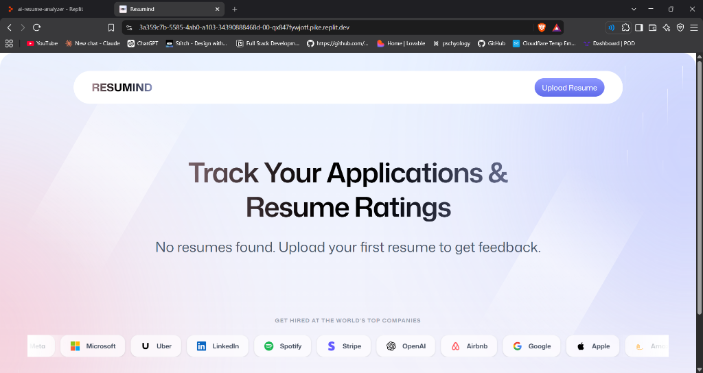
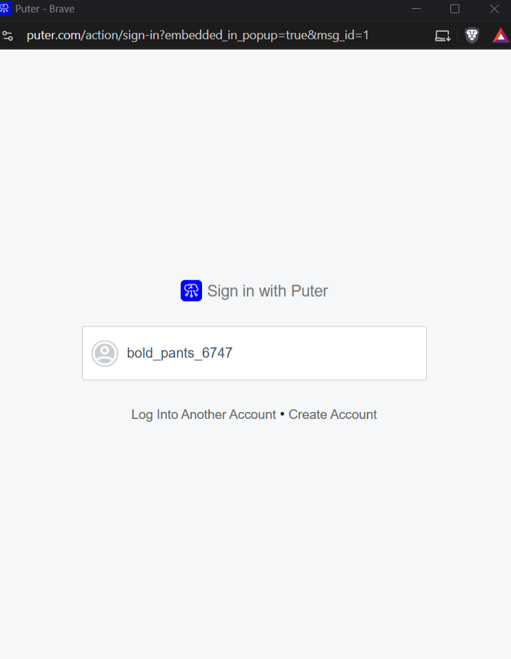
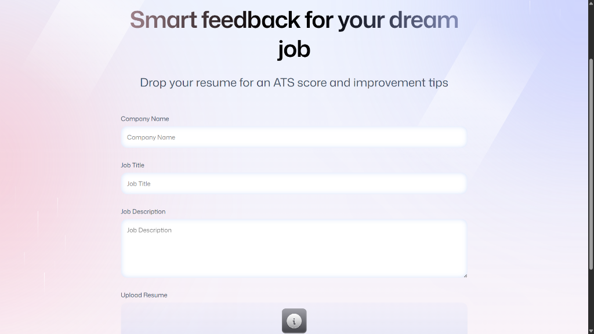

# Resumind — AI Resume Analyzer

Resumind is a browser-based AI resume analyzer that helps job seekers tailor a resume to a specific role. Upload a PDF resume, add the target company, role, and job description, and receive an ATS-focused review with practical, role-specific recommendations.

The application uses Puter.js for authentication, file storage, key-value persistence, and AI features, so it does not require a separate backend or API keys.

## Features

- Secure sign-in through Puter
- PDF-only resume upload with a 20 MB file limit
- AI-powered resume analysis tailored to a job title and description
- Overall score plus detailed ATS, content, structure, skills, and tone feedback
- Job-match score with matched, missing, and recommended keywords
- Suggested professional-summary and experience-bullet rewrites
- AI-generated cover letters and interview-preparation questions
- Application tracker with search and status filters (`Saved`, `Applied`, `Interview`, `Offer`, and `Rejected`)
- Cloud-backed storage for uploaded resumes and analysis results

## Screenshots

### Application Dashboard & Tracking


### Authentication Flow
<p align="center">
  
  
</p>

### Job Details & Resume Upload


### AI ATS Score & Feedback Analysis


## Tech Stack

- React 19
- React Router v7
- TypeScript
- Vite
- Tailwind CSS v4
- Zustand
- React Dropzone
- PDF.js
- Puter.js

## Getting Started

### Prerequisites

- Node.js 18 or later
- npm
- A Puter account to use the application features

### Installation

```bash
git clone <your-repository-url>
cd ai-resume-analyzer
npm install
```

### Run locally

```bash
npm run dev
```

Open the local address shown by Vite in your browser (the development configuration uses port `5000`).

### Production build

```bash
npm run build
npm run start
```

### Type-check

```bash
npm run typecheck
```

## How It Works

1. Sign in with Puter.
2. Add the company name, job title, and job description.
3. Upload a PDF resume.
4. The app stores the PDF, converts it to an image for preview, and sends the resume with the job context to the AI service.
5. Review scores, keyword matching, improvement suggestions, and optional application materials.
6. Update the application status or notes as your job search progresses.

## Project Structure

```text
app/
  components/    Reusable interface and analysis components
  lib/           Puter, PDF conversion, and AI helpers
  routes/        Dashboard, authentication, upload, and review pages
constants/       AI feedback schema and analysis instructions
public/          Static images, icons, and README media
types/           TypeScript declarations
```

## Privacy Note

Resumes can contain sensitive personal information. Use test or redacted documents for demos and screenshots, and review Puter's storage and privacy settings before uploading real resumes.

## License

No license has been specified. Add a `LICENSE` file before distributing or open-sourcing this project.
