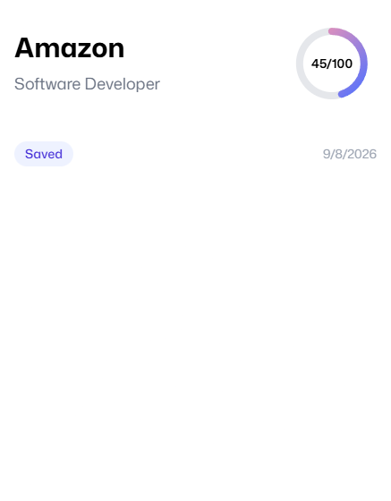

# Resumind — AI Resume Analyzer

Resumind is an AI-powered resume and job application assistant. Upload a resume, add the target company and job description, and receive tailored feedback instead of a generic resume score.

This project uses Puter for authentication, file storage, and AI requests. Users sign in with Puter before uploading resumes or generating application materials.

## Features

- Resume upload and PDF preview
- ATS score and resume quality feedback
- Job match score based on the target job description
- Matching, missing, and recommended keywords
- AI-rewritten professional summary
- Before-and-after resume bullet suggestions
- Quick improvement checklist
- Customized cover letter generation
- Interview questions and answer guidance for each resume and job description
- Application tracker with these statuses:
  - Saved
  - Applied
  - Interview
  - Offer
  - Rejected
- Application notes
- Homepage search and status filters
- Downloadable review summary
- Responsive resume dashboard
- Inline company logo marquee
- Automatic resume preview fallback to the original PDF

## Screenshots

### Resume analysis examples

<p align="center">
  
  
  
</p>

### Application dashboard

The dashboard shows saved applications, scores, dates, statuses, search, and filtering.



## How the AI works

The app sends the uploaded resume file and the supplied job information to Puter AI. The current model is:

```text
gpt-4o-mini
```

The AI receives:

- The uploaded resume
- Company name
- Job title
- Job description

This allows the job match, cover letter, and interview questions to be tailored to both the candidate and the specific role.

The app does not contain an OpenAI API key. Puter manages the AI request through the signed-in user's Puter session.

## Tech stack

- React 19
- React Router 7
- TypeScript
- Vite
- Tailwind CSS
- Zustand
- Puter.js
- `pdfjs-dist`
- `react-dropzone`

## Getting started

### Prerequisites

- Node.js 20 or newer
- npm
- A Puter account for authentication, storage, and AI analysis

### Installation

```bash
git clone https://github.com/YOUR_USERNAME/YOUR_REPOSITORY.git
cd YOUR_REPOSITORY
npm install
```

### Start the development server

```bash
npm run dev
```

The Replit workflow serves the app on port `5000`.

### Production build

```bash
npm run typecheck
npm run build
npm start
```

## Using the app

1. Open the app and sign in with Puter.
2. Choose **Upload Resume**.
3. Enter the company name.
4. Enter the target job title.
5. Paste the job description.
6. Upload a PDF resume.
7. Select **Analyze Resume**.
8. Review the ATS score, job match, keywords, and improvement suggestions.
9. Generate a cover letter or interview preparation.
10. Set the application status and add notes.

Interview questions and generated application materials are saved with the related resume and job application.

## Data and privacy

Resumes may contain personal information. Resume files and application records are stored through Puter for the signed-in user.

- Do not upload resumes that you do not have permission to process.
- Review Puter's privacy and usage policies before using the app with sensitive documents.
- Delete stored resume data when it is no longer needed.
- Never commit `.env` files, API keys, passwords, session secrets, or private credentials.

This project does not require an OpenAI API key in the source code. Replit-managed secrets remain outside the repository.

## Validation

Run these checks before publishing changes:

```bash
npm run typecheck
npm run build
```

## Replit configuration

The project is configured for Replit with:

- Development server port `5000`
- Host `0.0.0.0`
- Proxied hosts enabled
- `npm run dev` as the workflow command

## Attribution

This project is based on the open-source AI Resume Analyzer project by Adrian Hajdin:

https://github.com/adrianhajdin/ai-resume-analyzer

The current version includes additional job matching, resume improvement, cover letter, interview preparation, application tracking, dashboard filtering, and resume preview improvements.